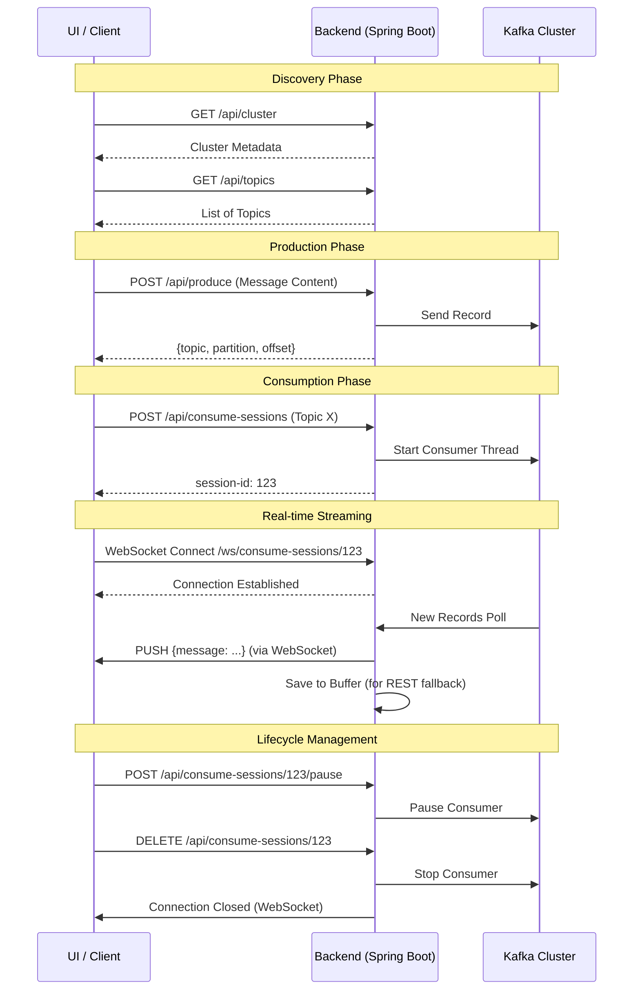

# Kafka Observatory - User Flow Document

This document describes the high-level end-to-end user flows in the Kafka Observatory project, following a **Client-Server** architecture.

---

## 1. Interaction Overview

The system uses a hybrid communication model:
1.  **REST (Request/Response)**: For metadata discovery (clusters, topics) and session control (start, stop, pause).
2.  **WebSocket (Push)**: For real-time, high-frequency message streaming from Kafka to the UI.

---

## 2. Core Flows

### Flow A: Real-time Data Observation
This is the primary flow for a user wanting to "observe" a topic live.

1.  **Initialization**: User selects a topic in the UI and clicks "Observe".
2.  **Session Creation**: UI sends `POST /api/consume-sessions` with topic name and offset strategy.
3.  **Stream Setup**: After receiving the `sessionId`, the UI immediately opens a WebSocket connection to `/ws/consume-sessions/{sessionId}`.
4.  **Live Monitoring**: As Kafka producers send data to the topic, the backend polls it and pushes it over the WebSocket. The UI renders these messages in a scrolling list or table.
5.  **Offline Buffering**: Even if the UI loses WebSocket connection briefly, the backend maintains an in-memory buffer (e.g., last 500 messages). The user can fetch missed messages via `GET /api/consume-sessions/{sessionId}/messages`.

### Flow B: Backpressure and Scalability
To ensure the backend doesn't crash if the user's browser or network is slow:

1.  **Detection**: The Server detects a slow client when the WebSocket "send" buffer is full.
2.  **Dropping**: Instead of queuing thousands of messages for one slow client, the Server **drops** new messages for that specific client.
3.  **Stability**: The Kafka poll loop remains unblocked, ensuring other clients and the core engine stay healthy.

### Flow C: Operational Control
Users can manage active consumers without stopping them entirely.

1.  **Pause**: User clicks "Pause" in the UI. Backend pauses the specific Kafka consumer. No new data is polled, saving battery/CPU/Network.
2.  **Resume**: User clicks "Resume". Polling starts exactly where it left off.
3.  **Timeout**: If a user closes their tab without "Stopping" the session, the Server automatically detects inactivity and closes the session after a timeout (e.g., 5 minutes) to reclaim resources.

### Flow D: Producing Data
Users can test their consumption logic without external tools.

1.  **Preparation**: User enters topic, key, and value in the Producer UI.
2.  **Submission**: User clicks "Send".
3.  **Validation**: Backend sends the data to Kafka and returns the assigned partition and offset.
4.  **Feedback**: The UI shows a success notification with the production metadata.

---

## 3. Error Handling Flow

Matching the [Error Handling Model](../docs/009_error_handling_model.md):

1.  **Kafka Disconnect**: If the backend loses connection to Kafka, the session state changes to `ERROR`.
2.  **WebSocket Notification**: The server closes the WebSocket connection with an appropriate error code/reason.
3.  **UI Feedback**: The UI should show a "Disconnected" or "Error" state to the user and offer a "Retry" button.
